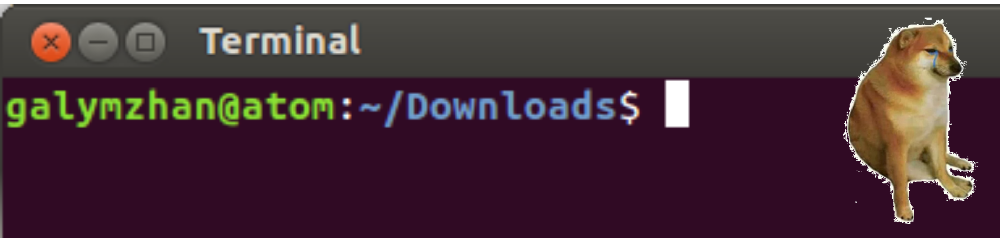
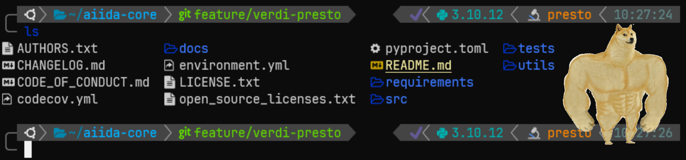

# Turn your `$SHELL` into a beautiful `$HOME`

Repository for the MSD group meeting about sexy shell configurations given on 2024-04-25 by Julian Geiger at PSI.

- [Turn your `$SHELL` into a beautiful `$HOME`](#turn-your-shell-into-a-beautiful-home)
  - [What the fuzz is about](#what-the-fuzz-is-about)
  - [Installation instructions via `docker`](#installation-instructions-via-docker)
  - [The `$HOME` decor](#the-home-decor)
    - [Turn-key solutions](#turn-key-solutions)
    - [Tools I cannot live without](#tools-i-cannot-live-without)
    - [More shell candy](#more-shell-candy)
  - [Why you should use Fish](#why-you-should-use-fish)
    - [A caveat](#a-caveat)
  - [Honorable mentions (mileage may vary)](#honorable-mentions-mileage-may-vary)
  - [Acknowledgements](#acknowledgements)

## What the fuzz is about

<details>
<summary>Today, we will go on a journey from:</summary>



</details>

<details>
<summary>to:</summary>



</details>

<details>
<summary>Because why spend half an hour on a  task, when you can spend half a day automating it?</summary>


</details>

So buckle up!

## Installation instructions via `docker`

To take it for a spin, clone [the repo](https://github.com/GeigerJ2/msd-gm-shell), install
[Docker](https://docs.docker.com/engine/install/) and [Docker
Desktop](https://docs.docker.com/desktop/install/linux-install/), and fire both up. Then, from inside the repo, run:

```shell
docker buildx build -t msd-gm-docker -f Dockerfile .
```

Now, feel free to grab a :coffee:... this is gonna take a few minutes. Once your image is built, run the container via:

```shell
docker run -it msd-gm-docker
```

or attach it to `VSCode` via the [Docker VS Code extension](https://marketplace.visualstudio.com/items?itemName=ms-azuretools.vscode-docker).

Tip: If you want to skip the build process, you can also directly run it by using the container registry of this repo via:

```shell
docker run -it ghcr.io/geigerj2/msd-gm-shell:latest
```

which will automatically pull the image in the background (thanks, @unkcpz!).

You are now ready to explore your beautiful new `$HOME`.

## The `$HOME` decor

When the container starts up, you will find a running Ubuntu 22.04 instance with working `bash`, `zsh`, and `fish`
installations. We will explore their configurations - in this order - with increasing time dedicated to each `$SHELL`. The
main tools that are set up are the following:

### Turn-key solutions

- `oh-my` configs &rarr; Custom configuration frameworks created by the community (themes, plugins, etc.):
  - [oh-my-bash](https://github.com/ohmybash/oh-my-bash)
  - [oh-my-zsh](https://github.com/ohmyzsh/ohmyzsh)
  - [oh-my-fish](https://github.com/oh-my-fish/oh-my-fish) (we are not actually using this, but it is listed here for completeness)
- Prompt customization frameworks:
  - Sorry, seems like no comparable tool exists for `bash` :cry:
  - [Powerlevel10k](https://github.com/romkatv/powerlevel10k/) for `zsh` (to avoid having to run the interactive
    configuration, my `.p10k.zsh` file is part of this repo)
  - [Tide](https://github.com/IlanCosman/tide) for `fish`

### Tools I cannot live without

- [atuin](https://github.com/atuinsh/atuin) &rarr; Replaces your shell history with an SQLite database (syncronizes between computers :wink:)
- [zoxide](https://github.com/ajeetdsouza/zoxide) &rarr; Creates a database of your visited paths
  - Or, alternatively [z](https://github.com/jethrokuan/z) (pure `fish` implementation)
- [tmux](https://github.com/tmux/tmux) &rarr; Terminal multiplexer (my personal config is part of this repo)

### More shell candy

- [exa](https://github.com/ogham/exa) &rarr; "Modern replacement for `ls`" (more symbols!)
  - `exa` archived &rarr; [eza](https://github.com/eza-community/eza)

- [bat](https://github.com/sharkdp/bat) &rarr; "A `cat` clone with wings" (and syntax highlighting :wink:)
- [entr](https://github.com/eradman/entr) &rarr; Run arbitrary commands on file changes
- [fzf](https://github.com/junegunn/fzf) &rarr; Command line fuzzy finder
- `git plugins` for `zsh` (part of `oh-my-zsh`) and `fish` &rarr; [plugin-git](https://github.com/jhillyerd/plugin-git)
- [AstroNvim](https://astronvim.com) &rarr; `(neo)vim` on steroids (don't worry, beloved `VSCode` - you will never be replaced)
  - Good to learn some of the nitty-gritty details, but I discourage trying to customize that yourself, as you'll
  literally need to learn a (probably) new language (Lua)

<details>
<summary>AstroNvim screenshot</summary>


</details>


## Why you should use Fish

- First, let's install [tide](https://github.com/IlanCosman/tide) with fisher and configure it
- Then, let's check out `fish_config`
- It underlines existing paths/files &rarr; No more "no such file or directory"
- Neat autosuggestions (to be fair, [this plugin](https://github.com/zsh-users/zsh-autosuggestions) achieves the same in `zsh`)
- Interactive `CLI` command/options search
- Cherry on top &rarr; [fzf fish plugin](https://github.com/PatrickF1/fzf.fish)
- And a shameless self-promotion of [my `aiida` fish plugin](https://github.com/GeigerJ2/plugin-aiida) :rocket:

([even more fish](https://github.com/jorgebucaran/awsm.fish))

### A caveat

- `fish` not POSIX compliant (unlike `bash` and `zsh`) &rarr; Different (but, I would argue, better) syntax
- Different configuration

&rarr; If you don't want to enter this rabbit hole, stay with `zsh` for now (or use my `Dockerfile` :innocent:) <br>
&rarr; But, you can always enter other shells, or execute scripts with `bash <your-script>.sh`

## Honorable mentions (mileage may vary)

- [fd](https://github.com/sharkdp/fd) &rarr; "A simple, fast and user-friendly alternative to `find`"
- [ripgrep](https://github.com/BurntSushi/ripgrep) &rarr; Fast, recursive terminal `regex` search
- [lazygit](https://github.com/jesseduffield/lazygit) &rarr; Terminal `git` UI for keyboard warriors
- [gdu](https://github.com/dundee/gdu) &rarr; Disk usage analyzer
- [bottom](https://github.com/ClementTsang/bottom) &rarr; "Yet another cross-platform graphical process/system monitor"

- [gh](https://github.com/cli/cli) &rarr; GitHub `CLI` and [gh act](https://github.com/nektos/act) &rarr; run GitHub
  actions locally (sorry for all the failed CI activity, `@sphuber` :cry:)

## Acknowledgements

GPT4, GitHub copilot, Pol Sanz &rarr;
 ,

the `software-treats` Slack channel of the Nuria Lopez Group (ICIQ), and all of you for listening to this rant.
